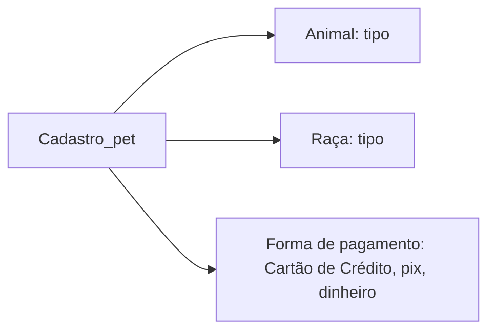

# Cadastro-Petshop
##Diagrama de classes

```mermaid
graph LR
  Cadastro_pet --> Animal
  Cadastro_pet --> Raça
  Cadastro_pet --> Forma_de_pagamento

  Cadastro_pet["Cadastro_pet"]
  Animal["Animal: tipo"]
  Raça["Raça: tipo"]
  Forma_de_pagamento["Forma de pagamento: Cartão de Crédito, pix, dinheiro"]

```
